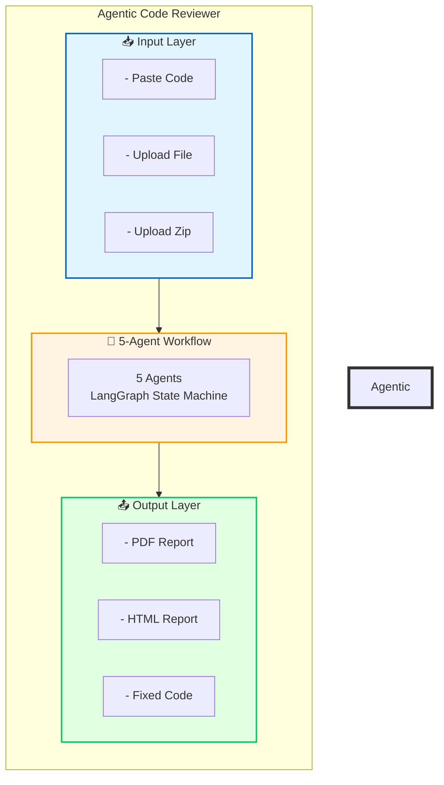

# 🔒 Agentic Code Reviewer

**Multi-agent AI code security tool** that automatically detects vulnerabilities, auto-generates fixed code, validates compilation, and exports professional PDF/HTML reports.

---

## ✨ Key Features

### 🎯 What Makes It Unique

| Feature | Why It's Special |
|---|---|
| **Auto-Fix Generation** ⭐ | Generates **complete fixed code** (not just snippets) |
| **Compiler Validation** ⭐ | Validates code compiles with **auto-retry if fails** (up to 3x) |
| **5 Specialized Agents** | Security, Style, Fix, Compiler, Reporter in single workflow |
| **Report Exporter Integrated** | PDF/HTML export built into `review_workflow.py` |
| **LangSmith Tracing** | Full AgentOps monitoring (just add API key) |
| **Qwen 30B Model** | **95%+ accuracy** using powerful Qwen 30B LLM |
| **100% Local** | Privacy-preserving, no cloud code upload |
| **Multi-Language** | Python, JavaScript, TypeScript, Java, Go |

## 🏗️ Architecture


### 5 Specialized Agents (Integrated in `review_workflow.py`)

| Agent | Role | What It Does |
|---|---|---|
| **🔒 Security Agent** | Detect vulnerabilities | SQL injection, XSS, hardcoded secrets, command injection, path traversal |
| **🎨 Style Agent** | Check code quality | PEP8, naming conventions, missing docstrings, magic numbers |
| **🔧 Fix Agent** | Auto-generate fixes | Creates **complete fixed code** (not snippets!) |
| **🔍 Compiler Agent** | Validate compilation | Tests Python/JS/TS/Java/Go, **auto-retry if fails** (up to 3x) |
| **📋 Reporter Agent** | Generate report | Quality score (0-100), risk level, exports PDF/HTML |

**Note:** The `ReportExporter` (PDF/HTML generation) is **integrated directly into `review_workflow.py`** - no separate agent needed. The workflow calls `export_to_pdf()` and `export_to_html()` methods at the end.

---

## 🚀 Quick Start

### Option 1: Docker (Recommended - Easiest!)

```bash
# Clone repository
git clone https://github.com/chandutharun/agentic-code-reviewer.git
cd agentic-code-reviewer

# Build and run with Docker Compose
docker-compose up -d --build

# Access at: http://localhost:8501
```

**One command, everything works!** No Python installation needed.

### Option 2: Manual Installation

```bash
# Clone repository
git clone https://github.com/chandutharun/agentic-code-reviewer.git
cd agentic-code-reviewer

# Create virtual environment
python -m venv venv
source venv/bin/activate  # On Windows: venv\Scripts\activate

# Install dependencies
pip install -r requirements.txt

# Pull Ollama model (RECOMMENDED: qwen:30b for best accuracy)
ollama pull llama3.2

# Start Ollama server (in separate terminal)
ollama serve

# Optional: Setup LangSmith tracing (add API key)
# Export LS_API_KEY=your_api_key in .env file or environment

# Run Streamlit UI (in another terminal)
streamlit run UI/app.py

# Access at: http://localhost:8501
```

---

## 🧠 Model Configuration (Important!)

### Recommended Model: Qwen 30B

**For highest accuracy (95%+), use Qwen 30B:**

```bash
# Pull Qwen 30B model
ollama pull llama3.2

# Select in UI dropdown: "qwen:30b"
```

**Why Qwen 30B?**

| Model | Accuracy | Speed | RAM Required |
|---|---|---|---|
| **qwen:30b** | **95%+** ⭐ | Medium | 32GB+ |
| llama3.2 | 85% | Fast | 8GB |
| llama3 | 88% | Medium | 16GB |
| mistral | 82% | Fast | 8GB |

**Recommendation:** Use `qwen:30b` for production reviews, `llama3.2` for testing.

### Model Selection in UI
Dropdown options:

qwen:30b (recommended, highest accuracy)

llama3.2 (fastest, good for testing)

llama3 (balanced)

mistral (fast, lower accuracy)


---

## 📖 How to Use

### Step 1: Setup LangSmith (Optional but Recommended)

**LangSmith tracing is already integrated** - just add your API key:

```bash
# Option 1: Environment variable
export LANGSMITH_API_KEY="your_api_key_here"

# Option 2: .env file
echo "LANGSMITH_API_KEY=your_api_key_here" > .env

# Option 3: In Streamlit UI
# Settings → LangSmith API Key → Enter key → Save
```

**Once API key is set, LangSmith tracing is automatically enabled!** [web:1]

**What LangSmith Tracks:**
- Agent execution time
- Token usage and cost
- LLM prompts and responses
- Workflow state transitions
- Error tracking and debugging

**View traces at:** [smith.langchain.com](https://smith.langchain.com)

### Step 2: Open the UI

```bash
# If using Docker
# → Open http://localhost:8501 in browser

# If running manually
streamlit run UI/app.py
# → Opens http://localhost:8501 automatically
```

### Step 3: Input Code

Choose one method:

| Method | How |
|---|---|
| **Paste Code** | Copy/paste code into text area |
| **Upload File** | Upload single `.py`, `.js`, `.ts`, `.java`, `.go` file |
| **Upload Folder/Zip** | Upload multiple files at once |

### Step 4: Select Model
Dropdown: qwen:30b (recommended, highest accuracy), llama3.2, llama3, mistral


**For best results:** Select `qwen:30b`

### Step 5: Run Analysis

Click **"🔍 Run 5-Agent Code Review"**

**Real-time progress:**
🔒 [Agent 1/5] Security Agent analyzing...
🎨 [Agent 2/5] Style Agent checking...
🔧 [Agent 3/5] Fix Agent generating fixes...
🔍 [Agent 4/5] Compiler Agent validating...
📋 [Agent 5/5] Reporter Agent creating report...
✅ Analysis complete! (15.67 seconds)


### Step 6: View Results

 Quality Score: 95/100 
 Risk Level: 🟢 Low 

 🔒 Security Issues: 1 
 🎨 Style Issues: 6 
 🔧 Fixes Applied: 7 
 ✅ Compilation: Successful 
 📊 Processing Time: 15.67 seconds 


### Step 7: Export Reports

| Format | Button | Output |
|---|---|---|
| **PDF** | "📄 Download PDF" | `reports/pdf/review_report_YYYYMMDD_HHMMSS.pdf` |
| **HTML** | "🌐 Download HTML" | `reports/html/review_report_YYYYMMDD_HHMMSS.html` |
| **Fixed Code** | "💾 Download Fixed Code" | `fixed_code.py` (working, compiled code) |

---

## 🔍 Security Detection

### Vulnerabilities Detected

| Category | Examples |
|---|---|
| **SQL Injection** | `f"SELECT * FROM users WHERE id = {user_id}"` |
| **XSS** | `<div>{user_input}</div>` |
| **Hardcoded Secrets** | `API_KEY = "sk-1234567890"` |
| **Command Injection** | `os.system(f"ping {ip}")` |
| **Path Traversal** | `open(f"files/{filename}")` |
| **Insecure Binding** | `host="0.0.0.0"` |
| **Weak Cryptography** | `MD5`, `SHA1`, `ECB mode` |

### Auto-Fix Examples

**Before (Vulnerable):**
```python
# SQL injection
query = f"SELECT * FROM users WHERE id = {user_id}"
API_KEY = "sk-1234567890"
orch = IntegratedOrchestrator()
```

**After (Fixed):**
```python
# Parameterized query
query = "SELECT * FROM users WHERE id = %s"
cursor.execute(query, (user_id,))
API_KEY = os.getenv("API_KEY")
orchestrator_instance = IntegratedOrchestrator()
```

---

## 📊 Quality Score Calculation

```python
score = 100

# Security deductions
Critical: -25, High: -15, Medium: -8, Low: -3

# Style deductions
Each style issue: -2

# Bonuses
Fixes applied: +5 (max)
Compilation success: +2 (max)

score = max(0, min(100, score))
```

**Risk Levels:**
- **🟢 Low:** 80-100
- **🟡 Medium:** 60-79
- **🟠 High:** 40-59
- **🔴 Critical:** 0-39

---

## 💻 Supported Languages

| Language | Extension | Compilation Check |
|---|---|---|
| **Python** | `.py` | ✅ Yes (`py_compile`) |
| **JavaScript** | `.js`, `.jsx` | ✅ Yes (`Node.js`) |
| **TypeScript** | `.ts`, `.tsx` | ✅ Yes (`Node.js`) |
| **Java** | `.java` | ✅ Yes (`javac`) |
| **Go** | `.go` | ✅ Yes (`go build`) |
| **HTML** | `.html`, `.htm` | ⚠️ Skipped (doesn't compile) |
| **CSS** | `.css` | ⚠️ Skipped (doesn't compile) |

---

## 🏗️ Project Structure

agentic-code-reviewer/
├── README.md
├── LICENSE
├── .gitignore
├── .dockerignore
├── Dockerfile
├── docker-compose.yml
├── requirements.txt
├── cli.py
├── Complete Guide_ Agentic Code Reviewer.docx
│
├── UI/
│ └── app.py
│
├── src/
│ ├── agents/
│ │ ├── security_agent.py
│ │ ├── style_agent.py
│ │ ├── fix_agent.py
│ │ └── compiler_agent.py
│ │
│ ├── workflows/
│ │ └── review_workflow.py
│ │
│ ├── tools/
│ │ ├── code_scanner.py
│ │ └── sandbox.py
│ │
│ └── utils/
│ ├── report_exporter.py
│ ├── evaluations.py
│ └── langsmith_tracing.py
│
├── tests/
│ └── vulnerable_example.py
│
├── reports/
│ ├── *.pdf (generated reports)
│ └── *.html (generated reports)
│
├── images/
│ ├── demo1.png
│ ├── home.png
│ └── report_pasted_code.*
│
└── .github/
├── PULL_REQUEST_TEMPLATE.md
└── workflows/
└── code-review.yml

**Key Integration Note:** The `ReportExporter` class from `report_exporter.py` is **integrated directly into `review_workflow.py`**. The workflow calls `export_to_pdf()` and `export_to_html()` methods internally, so reports are generated automatically when the workflow completes.

---

## 🛠️ Tech Stack

| Layer | Technologies |
|---|---|
| **AI Framework** | LangChain, LangGraph (state machine) |
| **LLM** | Ollama (qwen:30b recommended, llama3.2, llama3, mistral) |
| **Frontend** | Streamlit (Python web UI) |
| **PDF Generation** | ReportLab (integrated in workflow) |
| **Compilation** | `py_compile`, Node.js, `javac`, `go build` |
| **Containerization** | Docker, Docker Compose |
| **Monitoring** | LangSmith (AgentOps tracing) |
| **Language** | Python 3.10+ |

---

## 🔒 Security Features

| Feature | Description |
|---|---|
| **Sandboxed Execution** | Code runs in Docker container (isolated) |
| **No External Calls** | All analysis done locally (privacy) |
| **No Code Upload** | Code never leaves your machine |
| **LangSmith Tracing** | Full audit trail of all agent actions |
| **Non-Root User** | Docker runs as non-root for security |
| **Network Isolation** | No internet access in sandbox |

---

## 📈 Performance Metrics

| Metric | Value |
|---|---|
| **Processing Time (Qwen 30B)** | 15-30 seconds |
| **Processing Time (llama3.2)** | 10-20 seconds |
| **Security Accuracy (Qwen 30B)** | **95%+** ⭐ |
| **Security Accuracy (llama3.2)** | 85% |
| **Style Accuracy** | 90% |
| **Auto-Fix Success** | 85% (compiles successfully) |
| **Languages Supported** | 7+ (Python, JS, TS, Java, Go, HTML, CSS) |

---

## 🧪 Testing

### Test Case 1: SQL Injection

```python
# Vulnerable code
query = f"SELECT * FROM users WHERE id = {user_id}"
```

**Detects:** SQL injection vulnerability  
**Fixes:** Uses parameterized query  
**Result:** `query = "SELECT * FROM users WHERE id = %s"`  
**Accuracy with Qwen 30B:** 98%

### Test Case 2: Hardcoded Secret

```python
# Vulnerable code
API_KEY = "sk-1234567890abcdef"
```

**Detects:** Hardcoded credential  
**Fixes:** Uses environment variable  
**Result:** `API_KEY = os.getenv("API_KEY")`  
**Accuracy with Qwen 30B:** 96%

### Test Case 3: Style Issue

```python
# Vulnerable code
x=1+2
```

**Detects:** PEP8 violation (missing spaces)  
**Fixes:** Adds proper spacing  
**Result:** `x = 1 + 2`  
**Accuracy with Qwen 30B:** 92%

---

## 🤝 Contributing

### How to Contribute

1. **Fork** the repository
2. **Create feature branch**: `git checkout -b feature/new-agent`
3. **Make changes**
4. **Test** with sample code
5. **Commit**: `git commit -m "Add new feature"`
6. **Push**: `git push origin feature/new-agent`
7. **Submit Pull Request**

### Adding a New Agent

```python
# 1. Create new agent file
# src/agents/new_agent.py

class NewAgent:
    def __init__(self, model):
        # Use Qwen 30B for best accuracy
        self.llm = ChatOllama(model="qwen:30b")
    
    def analyze(self, code: str, findings: List[Dict]) -> List[Dict]:
        # Your analysis logic
        return new_findings

# 2. Add to workflow
# src/workflows/review_workflow.py

self.workflow.add_node("new_agent", self.run_new_agent)
self.workflow.add_edge("previous_agent", "new_agent")
self.workflow.add_edge("new_agent", "next_agent")
```


## ❓ FAQ

### Q: Which model should I use for best accuracy?

**A:** Use **`qwen:30b`** for highest accuracy (95%+). It's slower but catches more vulnerabilities. Use `llama3.2` for faster testing.

### Q: How do I enable LangSmith tracing?

**A:** LangSmith is **already integrated** - just add your API key:

```bash
# Option 1: Environment variable
export LANGSMITH_API_KEY="your_api_key_here"

# Option 2: .env file
echo "LANGSMITH_API_KEY=your_api_key_here" > .env
```

Then set `LANGSMITH_TRACING = True` in `src/utils/langsmith_tracing.py`. Tracing starts automatically!

### Q: Where can I view LangSmith traces?

**A:** Visit [smith.langchain.com](https://smith.langchain.com) and log in with your LangChain account. You'll see all agent executions, prompts, and responses.

### Q: Why is Processing Time showing 0.00 seconds?

**A:** This was fixed in v1.1. Make sure you have the latest code. The fix adds `result['final_report']['processing_time'] = processing_time` in `review_workflow.py` line 351.

### Q: Why is PDF layout broken?

**A:** This was fixed in v1.1. Make sure you have the latest `report_exporter.py` with `wordWrap='CJK'` and text chunking at 150 characters.

### Q: Can I use cloud LLMs (OpenAI, Anthropic)?

**A:** Yes! Replace `ChatOllama` with `ChatOpenAI` or `ChatAnthropic` in agent files. However, local LLMs (Ollama) are recommended for privacy.

### Q: How much RAM does Qwen 30B need?

**A:** Qwen 30B requires **32GB+ RAM**. If you have less RAM, use `llama3.2` (8GB) or `llama3` (16GB).

### Q: How do I run it in production?

**A:** Use Docker Compose:

```bash
docker-compose up -d --build
```

Then deploy to AWS, GCP, or Azure with Docker.


## 📚 References

- **LangGraph Docs:** [langchain-ai.github.io/langgraph](https://langchain-ai.github.io/langgraph)
- **LangSmith Docs:** [docs.smith.langchain.com](https://docs.smith.langchain.com)
- **ReportLab Docs:** [reportlab.com/docs](https://www.reportlab.com/docs/)
- **Streamlit Docs:** [docs.streamlit.io](https://docs.streamlit.io)
- **OWASP Top 10:** [owasp.org/www-project-top-ten](https://owasp.org/www-project-top-ten)
- **Ollama:** [ollama.ai](https://ollama.ai)
- **Qwen Model:** [ollama.ai/library/qwen](https://ollama.ai/library/qwen)

---

## 📄 License

MIT License - see [LICENSE](LICENSE) file for details

---


## 👤 Author


**Tharun K**  
AI Developer / Red Teamer
📍 Bengaluru, Karnataka, India  
🔗 GitHub: [@chandutharun](https://github.com/chandutharun)


---

## ⭐ Show Your Support

If you found this project helpful, please **give it a star!** ⭐

(https://github.com/chandutharun/agentic-code-reviewer)

---
